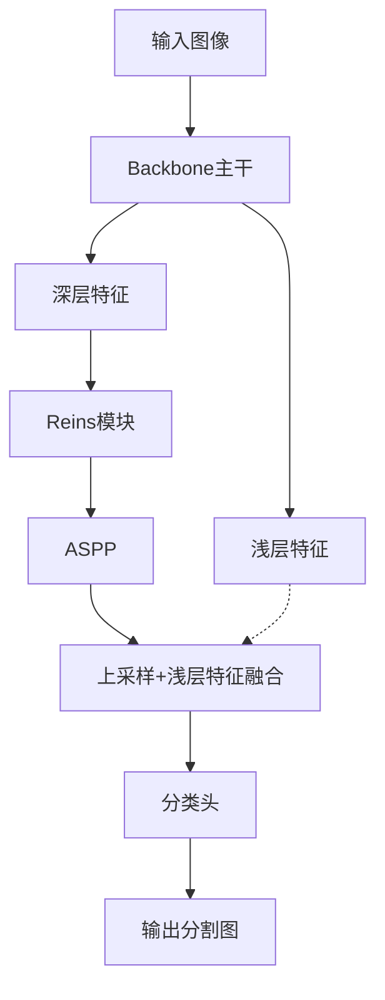

# Deeplab+Reins 对比分析与结构图

## 1. 主流分割主干与Reins模块对比分析

| 模型/模块         | 全局建模能力 | 多层特征融合 | 轻量化 | 结构创新 | 适合场景 | 与Reins关系/启发 |
|------------------|--------------|--------------|--------|----------|----------|-----------------|
| Xception         | 中           | 有           | 否     | 深度可分离卷积 | 高精度分割 | 可插入Reins增强深层特征 |
| MobileNetV2/3    | 弱           | 有           | 是     | 轻量主干      | 移动端/实时 | Reins可补足全局建模能力 |
| EfficientNet     | 中           | 有           | 是     | 复合缩放      | 高效分割   | 可与Reins协同提升表现 |
| ConvNeXt         | 强           | 有           | 一般   | 卷积改进      | SOTA      | 可探索Reins与其结合 |
| Swin Transformer | 强           | 有           | 一般   | Transformer  | SOTA      | Token机制与Reins类似，可互补 |
| SegFormer        | 强           | 强           | 是     | 多层融合+MLP  | SOTA      | 多点插入Reins可借鉴其思想 |

- **Reins优势**：
  - 可灵活插入任意主干，提升深层特征表达
  - 结构简单，参数量可控，适合轻量化场景
  - 理论上可与Transformer主干结合，进一步提升全局建模能力
- **劣势与局限**：
  - 主要作用于深层特征，浅层细节增强有限
  - 需合理设计token数、插入点，否则易带来冗余或过拟合
- **与SOTA模型的启发**：
  - SegFormer等采用多层融合+MLP/Attention，Reins可借鉴其多点插入、分层建模思想
  - 可探索Reins与主干多层输出的融合，或与ASPP/Transformer模块协同设计

## 2. Deeplab+Reins结构可视化

- 可扩展为多点插入：在backbone多层输出、ASPP前后等位置插入Reins

---
如需进一步补充实验数据、可视化图或对比分析，可在本文件持续完善。
