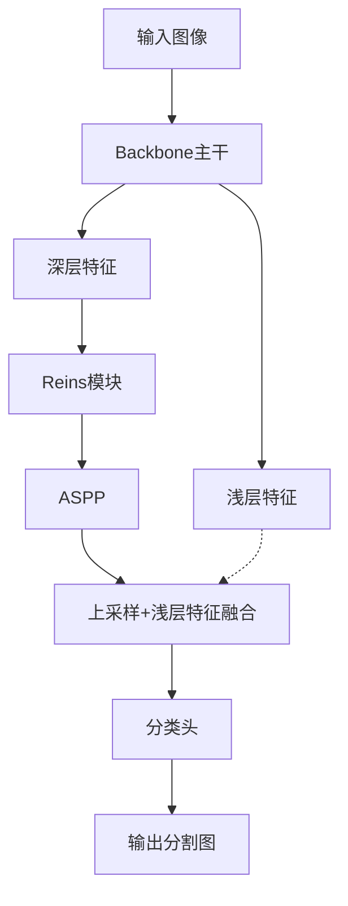

# Deeplab+Reins 实验流程与结构创新手册

## 一、Reins模块完善与创新建议

### 1. 检查与准备
- 检查`models/`目录下Reins相关实现（如`reins.py`、`deeplabv3_reins.py`），建议统一Reins模块代码，避免重复维护。
- 检查主干结构（如`deeplabv3_plus.py`、`deeplabv3_reins.py`），确保Reins模块插入点灵活可控（如backbone输出与ASPP之间、多点插入等）。
- 检查训练脚本（如`scripts/train.py`），确保所有实验参数（如token_length、embed_dims、num_layers、reins_pos等）均可通过命令行或配置文件传递，并自动归档。

### 2. 结构创新与实验设计
- 尝试多点插入Reins（如backbone多层、ASPP前后），对比单点插入与无Reins的分割表现。
- 可探索token参数自适应、与浅层特征融合、与ASPP/Transformer模块协同等创新结构。
- 参考SOTA模型（如SegFormer、Swin Transformer）的多层融合、全局建模思想，优化Reins结构。

### 3. 推荐参数设置
- `token_length`: 64~128（轻量主干建议64，重主干可用128）
- `embed_dims`: 与主干输出通道一致（如Xception为2048，MobileNetV2为320）
- `num_layers`: 1~2（一般1层即可，多点插入可设多层）
- `reins_pos`: 'aspp'（单点插入ASPP前），'backbone'（主干末端），'multi'（多点插入）
- 其它参数如`patch_size`、`scale_init`可用默认值

### 4. 推荐执行步骤
1. 统一/优化`models/reins.py`，确保Reins模块可灵活调用。
2. 在主干结构（如`deeplabv3_plus.py`）中，插入Reins模块于backbone输出与ASPP之间，并支持多点插入。
3. 检查/优化训练脚本，确保所有参数可配置、可归档。
4. 选择主干（如Xception、MobileNetV2），设置推荐参数，运行消融实验：
   - 无Reins（baseline）
   - 单点插入Reins（aspp/backbone）
   - 多点插入Reins（multi）
5. 归档每次实验的config.txt、日志、模型权重，便于复现与对比。
6. 分析mIoU、边界表现、推理速度、参数量等，撰写实验结论。

### 5. 实验记录合并与归档建议

建议所有实验（无Reins、单点插入、多点插入、不同主干等）统一归档在本手册“功能模块消融实验”板块和一份csv表格中，避免分散冗余。

#### 推荐实验记录表（experiment_records.csv）字段：
| 实验编号 | 主干 | reins_mode | 插入点 | token_length | embed_dims | num_layers | 其它参数 | 主要结果 | 结论 |
|----------|------|------------|--------|--------------|------------|------------|----------|----------|------|
| 101      | MobileNetV2 | multi | backbone+aspp | 64 | 320 | 2 | batch=8, lr=1e-3 | mIoU=XX.X | ... |
| 102      | Xception | single | aspp | 128 | 2048 | 1 | batch=4, lr=1e-3 | mIoU=XX.X | ... |
| ...      | ...  | ...        | ...    | ...          | ...        | ...        | ...      | ...      | ...  |

- 建议每次实验均自动归档config.txt、日志、权重、可视化结果，便于复现与对比。
- 可用Excel或pandas等工具自动合并历史实验记录。

## 结构可视化图



- 多点插入可扩展为：在backbone多层输出、ASPP前后等位置插入Reins。

## 参数推荐表

| 主干网络      | token_length | embed_dims | num_layers | reins_pos   | 适用场景         |
|---------------|--------------|------------|------------|-------------|------------------|
| Xception      | 128          | 2048       | 1~2        | aspp/backbone/multi | 高精度分割       |
| MobileNetV2   | 64           | 320        | 1~2        | aspp/backbone/multi | 轻量化/移动端    |
| ConvNeXt      | 128          | 768/1024   | 1~2        | aspp/multi  | SOTA/高精度      |
| SegFormer     | 64~128       | 256/512    | 1~2        | multi       | SOTA/多层融合    |

- 其它参数如patch_size、scale_init可用默认值（如patch_size=32，scale_init=0.001）。
- 多点插入时，num_layers建议与插入点数量一致。

## 功能模块消融实验

本节专门记录各功能模块（如Reins、ASPP、不同backbone等）的消融实验设计、参数与结果。

### 1. 参数化主模型代码示例

```python
from models.custom_deeplab import CustomDeeplab
from models.xception import xception
from models.mobilenetv2 import mobilenetv2
from models.deeplabv3_plus import ASPP
from models.reins import Reins

# 以MobileNetV2为例
backbone = mobilenetv2(pretrained=True)
aspp = ASPP(dim_in=320, dim_out=256)
reins_params = dict(num_layers=1, embed_dims=320, patch_size=32, token_length=64)

# 单点插入Reins于ASPP前
model = CustomDeeplab(backbone=backbone, aspp=aspp, use_reins=True, reins_params=reins_params, reins_insert_pos='aspp', num_classes=21)

# 无Reins（baseline）
model_baseline = CustomDeeplab(backbone=backbone, aspp=aspp, use_reins=False, num_classes=21)

# 多点插入Reins
model_multi = CustomDeeplab(backbone=backbone, aspp=aspp, use_reins=True, reins_params=reins_params, multi_reins_points=['backbone','aspp'], num_classes=21)
```

### 2. 已完成实验记录模板

| 实验编号 | 主干 | Reins参数 | 插入点 | 其它参数 | 主要结果 | 结论 |
|----------|------|-----------|--------|----------|----------|------|
| 001      | MobileNetV2 | token_length=64, embed_dims=320, num_layers=1 | aspp | batch=8, lr=1e-3 | mIoU=XX.X | ... |
| 002      | MobileNetV2 | 无 | - | batch=8, lr=1e-3 | mIoU=XX.X | ... |
| 003      | Xception | token_length=128, embed_dims=2048, num_layers=1 | aspp | batch=4, lr=1e-3 | mIoU=XX.X | ... |

- 建议每次实验均归档config.txt、日志、权重、可视化结果等，便于复现与对比。
- 可持续补充不同结构、参数、主干的消融实验。

### 4. 多点插入实验参数配置与记录模板

#### 推荐参数配置
- backbone: MobileNetV2
- reins_mode: multi
- multi_reins_points: ['backbone', 'aspp'] 或 ['backbone', 'aspp', 'shortcut']
- token_length: 64
- embed_dims: 320
- num_layers: 与插入点数量一致
- 其它参数：batch_size、lr等按实际需求设置

#### 实验记录模板

| 实验编号 | 主干 | reins_mode | 插入点 | token_length | embed_dims | num_layers | 其它参数 | 主要结果 | 结论 |
|----------|------|------------|--------|--------------|------------|------------|----------|----------|------|
| 101      | MobileNetV2 | multi | backbone+aspp | 64 | 320 | 2 | batch=8, lr=1e-3 | mIoU=XX.X | ... |
| 102      | MobileNetV2 | multi | backbone+aspp+shortcut | 64 | 320 | 3 | batch=8, lr=1e-3 | mIoU=XX.X | ... |
| 103      | MobileNetV2 | single | aspp | 64 | 320 | 1 | batch=8, lr=1e-3 | mIoU=XX.X | ... |
| 104      | MobileNetV2 | none | - | - | - | - | batch=8, lr=1e-3 | mIoU=XX.X | ... |

- 建议所有实验均归档config.txt、日志、权重、可视化结果，便于复现与对比。
- 可持续补充不同结构、参数、主干的消融实验。

#### 关于实验记录归档
- 之前的实验建议统一归档在本手册“功能模块消融实验”板块和实验记录表中，避免分散冗余。
- 可将所有实验参数、结果、结论集中维护在一份csv或md表格，便于团队协作和后续分析。

### 6. 各模型脚本定位与调用建议

- **deeplab.py**：推理/预测接口，适合部署和图片分割推理，不建议直接用于训练。
- **deeplabv3_plus.py**：标准DeepLabV3+结构，适合baseline或无Reins实验。
- **deeplabv3_reins.py**：集成Reins的DeepLabV3+，适合单点插入Reins实验。
- **custom_deeplab.py**：高度参数化、支持多点插入和结构创新的主模型，推荐用于所有创新和消融实验。
- 推荐在train.py中通过参数选择不同模型结构，统一训练入口，便于归档和对比。

### 7. config.py用法与优化建议

- config.py用于集中管理全局参数（路径、类别数、主干类型、训练参数等），便于统一维护和复现实验。
- 建议所有训练、评估、推理脚本均支持从config.py加载参数，并允许命令行覆盖。
- 优化建议：
  - 保持config.py参数与train.py、模型脚本一致
  - 支持自动归档config.txt，便于溯源
  - 逐步将常用参数迁移到config.py，减少硬编码

---
如需进一步可视化结构图、参数表或自动化脚本，可继续补充。
