# DeeplabV3+ 项目脚本调用关系图（2025-06-15 自动生成）

> 本图用于辅助理解主流程、各脚本间的依赖与调用关系，便于团队协作与维护。

```mermaid
graph TD
    subgraph 主入口
        train[train.py]
        predict[predict.py]
        get_miou[get_miou.py]
        run_reins_ablation[run_reins_ablation.py]
        run_multi_reins_experiments[run_multi_reins_experiments.py]
    end
    subgraph 核心模型
        custom_deeplab[models/custom_deeplab.py]
        deeplabv3_plus[models/deeplabv3_plus.py]
        deeplabv3_reins[models/deeplabv3_reins.py]
        mobilenetv2[models/mobilenetv2.py]
        reins[models/reins.py]
        xception[models/xception.py]
    end
    subgraph 工具与数据
        data_check_tools[scripts/data_check_tools.py]
        visualization_tools[scripts/visualization_tools.py]
        export_tools[scripts/export_tools.py]
        automation_tools[scripts/automation_tools.py]
        utils[utils/]
        config[config.py]
    end
    train -->|调用| custom_deeplab
    train -->|调用| deeplabv3_plus
    train -->|调用| deeplabv3_reins
    train -->|调用| mobilenetv2
    train -->|调用| xception
    train -->|调用| reins
    train -->|调用| data_check_tools
    train -->|调用| visualization_tools
    train -->|调用| export_tools
    train -->|调用| automation_tools
    train -->|调用| utils
    train -->|调用| config
    predict -->|调用| custom_deeplab
    predict -->|调用| deeplabv3_plus
    predict -->|调用| utils
    predict -->|调用| config
    get_miou -->|调用| utils
    get_miou -->|调用| config
    run_reins_ablation -->|批量调用| train
    run_multi_reins_experiments -->|批量调用| train
    data_check_tools -->|调用| utils
    visualization_tools -->|调用| utils
    export_tools -->|调用| utils
    automation_tools -->|调用| utils
    classDef main fill:#f9f,stroke:#333,stroke-width:2px;
    class train,predict,get_miou,run_reins_ablation,run_multi_reins_experiments main;
```

---

- 说明：
    - train.py 是主训练入口，依赖模型、工具、配置等模块。
    - predict.py、get_miou.py 分别为推理和评估主入口。
    - run_reins_ablation.py、run_multi_reins_experiments.py 支持批量实验，自动调用主训练脚本。
    - 各工具脚本（如 data_check_tools、visualization_tools、export_tools、automation_tools）均以函数形式服务于主流程。
    - config.py 统一管理参数，所有主流程均可调用。
    - utils/ 目录为通用工具库，被各主流程和工具脚本广泛依赖。

> 如有新功能/新模型，建议继续采用“合并-归档-文档化”流程，并及时补充本关系图与文档。
